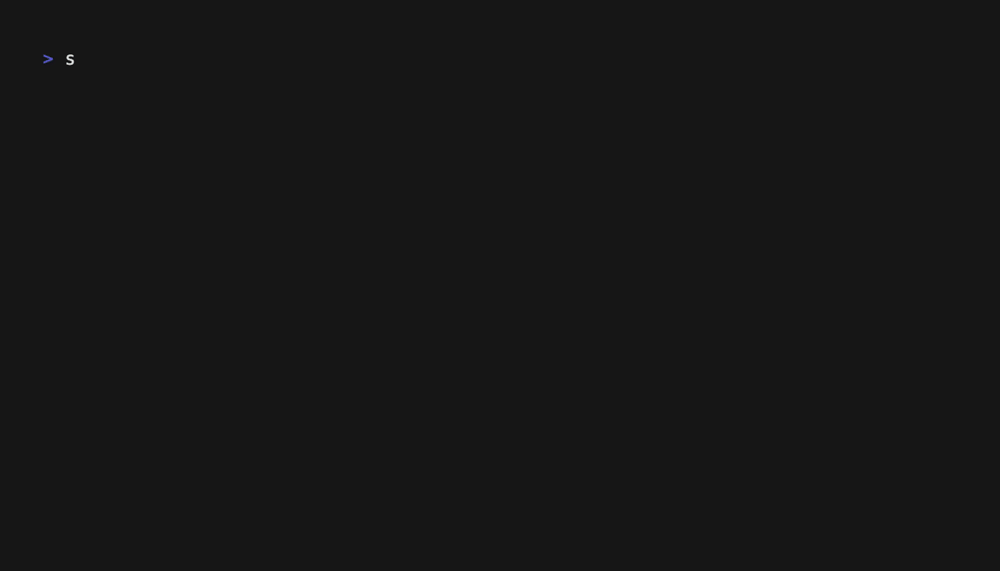

# fiSSH

Fish in your terminal.

---



---

To see it in action:

```sh
ssh -p 2222 isitafi.sh

# Depending on your SSH configuration, you may need to specify:
ssh -t -p 2222 isitafi.sh
```

---

# Development

```sh
bun install
```

To run:

```sh
bun run index.ts
```

Modify `main.ts` to change the renderer. Over SSH, view the rendering at `ssh -p 2222 localhost`.
