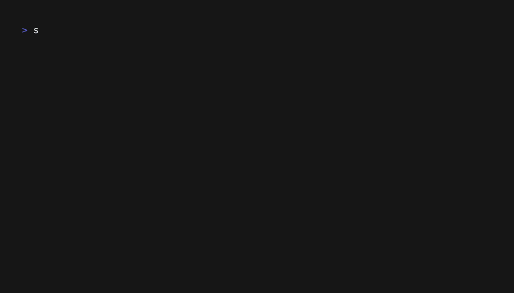

# fiSSH

Fish in your terminal.

```sh
ssh isitafi.sh # You may need to specify '-t' depending on your SSH configuration.
```

---



---

# Development

```sh
bun install
```

To run:

```sh
bun run main.ts
```

Modify `main.ts` to switch the renderer. 
View the SSH rendering at `ssh localhost`.
View the terminal rendering via `bun run main.ts`.
